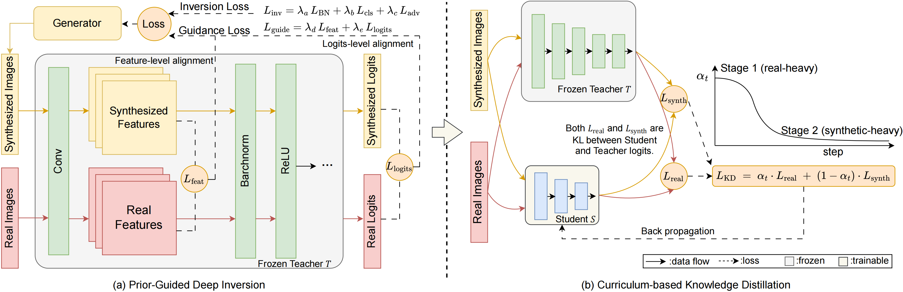

# Prior-Guided Deep Inversion for Few-Shot Knowledge Distillation

[cite_start]Official PyTorch implementation of **PGDI**[cite: 277]. [cite_start]We propose a few-shot distillation framework that leverages limited labeled samples as **priors** to guide model inversion, ensuring synthetic data closely matches the real distribution[cite: 298, 311].



## 📊 Results (CIFAR-100 5-shot)

[cite_start]PGDI achieves state-of-the-art performance by effectively utilizing limited data[cite: 492].

| Student | Teacher | PGDI (Ours) |
| :--- | :--- | :--- |
| **ResNet-18** | ResNet-34 | **77.13%** |
| **ResNet-18** | VGG-11 | **70.97%** |
| **WRN-16-1** | WRN-40-2 | **53.97%** |

## 🚀 Quick Start

### 1. Install Requirements
```bash
pip install -r requirements.txt
```

### 2. Prepare Models
To reproduce our results, please download pre-trained teacher models from [Dropbox-Models (266 MB)](https://www.dropbox.com/scl/fo/zbdyf9c7ami7ywmd2z6hd/ALLlm4mb4Ba3Q2njRg1xsOw?rlkey=y42mw3kcehtp4l9h7y55vt2d5&e=1&dl=0) and extract them as `checkpoints/pretrained`.

```bash
# Ensure the path looks like this:
# ./checkpoints/pretrained/cifar100_wrn40_2.pth
```

### 3. Run Distillation
You can run the distillation using the provided script or the python command below:

```bash
python fewshot_kd.py \
    --method PGDI \
    --dataset cifar100 \
    --teacher wrn40_2 \
    --student wrn16_1 \
    --epochs 200 \
    --fewshot_n_per_class 5 \
    --synthesis_batch_size 512 \
    --gpu 0 \
    --save_dir "run/PGDI_experiment"
```